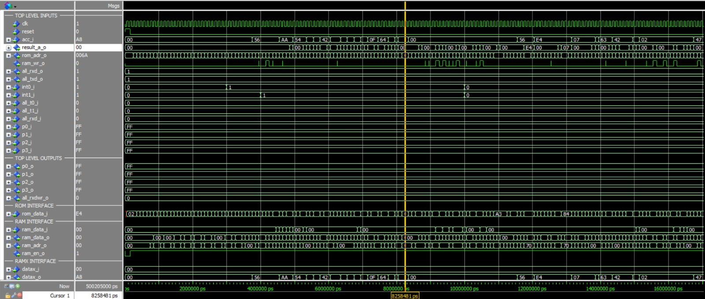

# Analisis Arsitektur dan Kinerja Modifikasi IP Core MC8051 pada Eksekusi Program Array Summation

Proyek tugas mata kuliah Organisasi dan Arsitektur Komputer yang menganalisis eksekusi program Array Summation pada platform Oregano MC8051 IP Core menggunakan ModelSim.

## Anggota Kelompok

| Nama | NIM |
|------|-----|
| Muhammad Alfarizq | 24/542274/PA/23023 |
| Hizkia Imanuel Prasetya | 24/533897/PA/22627 |
| Fikri Abqari Fawwaz | 24/537606/PA/22785 |
| M. Daffa Raditya Budiman | 24/537800/PA/22797 |
| Samuel Marcel Jonathan Panjaitan | 24/541509/PA/22977 |

## Hasil Eksperimen

| Eksperimen | Hasil |
|------------|--------|
| Loop Unrolling | Waktu eksekusi berkurang 43.5% |
| Modifikasi SIU & Timer | Penghematan LUT sekitar 20% |
| Fungsionalitas ALU | Tetap identik |
| Hasil Komputasi | Tetap menghasilkan 1AH (26 desimal) |

## Detail Arsitektur

MC8051 terdiri atas:

- Control Unit (FSM)
- Arithmetic Logic Unit (ALU)
- ROM Interface
- RAM Interface
- Serial Interface Unit (SIU)
- Timer/Counter
- I/O Ports

## Alur Kerja

1. Menulis program Assembly 8051
2. Kompilasi menjadi Intel HEX
3. Konversi HEX → DUA
4. Simulasi pada ModelSim
5. Pengamatan Waveform
6. Modifikasi VHDL
7. Simulasi ulang
8. Analisis performa

## Performance Comparison

| Metric | Loop | Loop Unrolling |
|----------|----------|----------|
| Machine Cycles | 23 | 13 |
| Clock Cycles | 46 | 26 |
| Execution Time | 4600 ns | 2600 ns |
| Improvement | - | 43.5% |

## Hardware Resource Comparison

| Parameter | Standard | Modified |
|------------|------------|------------|
| SIU | 1 | 0 |
| Timer | 2 | 1 |
| Estimated LUT | 3500 | 2800 |
| Resource Saving | - | 20% |

## Repository Structure

📂 src/
 ├── array_sum.asm
 ├── array_sum.dua
 ├── array_sum.hex
 ├── array_sum_optimized.asm
 ├── array_sum_optimized.hex
 └── mc8051 rom.dua

📂 vhdl_modified/
 └── mc8051_p_modified.vhd

📂 scripts/
 ├── setup_sim.do
 ├── setup_sim_modified.do
 └── convert_hex.sh

📂 docs/
 ├── arch_diagram.png
 ├── flowchart.png
 ├── waveform.jpeg
 └── loop_timing.png
 
## Cara Menjalankan

1. Ekstrak `mc8051_design_v1.6.zip` ke direktori kerja
2. Konversi file HEX ke format .dua:
   ```bash
   cd msim/
   gcc hex2dual.c -o hex2dual
   ./hex2dual ../src/array_sum.hex
   cp array_sum.dua mc8051_rom.dua
   ```
3. Jalankan ModelSim:
   ```tcl
   vlib work
   vmap work work
   do mc8051_compile.do
   vsim work.tb_mc8051_top_sim_cfg
   do mc8051_wave.do
   run -all
   ```
   
## ModelSim Waveform Analysis


<div align="center">

Siklus Looping

</div>
<br>
<br>


Observasi:
- Program Counter melakukan branch saat DJNZ.
- ALU menghasilkan output 1AH.
- Fetch–Decode–Execute dapat diamati secara langsung.

## Conclusion

- Loop unrolling mengurangi waktu eksekusi sebesar 43.5%.
- Modifikasi periferal tidak mempengaruhi hasil komputasi.
- Pengurangan SIU dan Timer menghasilkan penghematan LUT sekitar 20%.
- Arsitektur MC8051 menunjukkan modularitas yang tinggi untuk implementasi FPGA.
